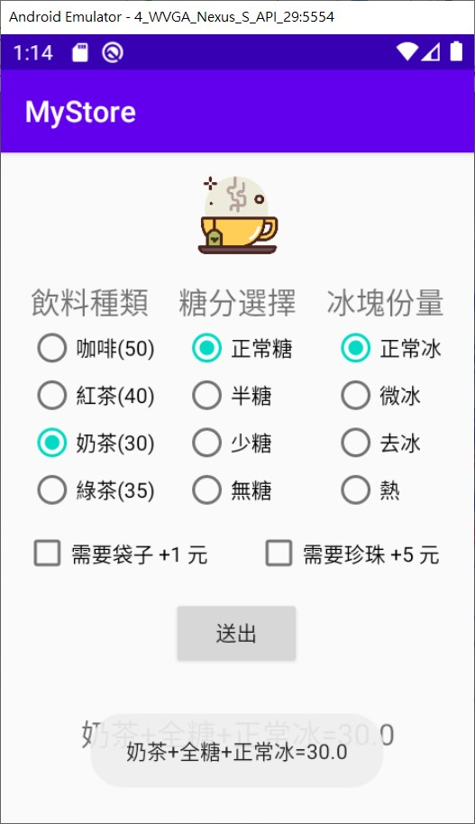
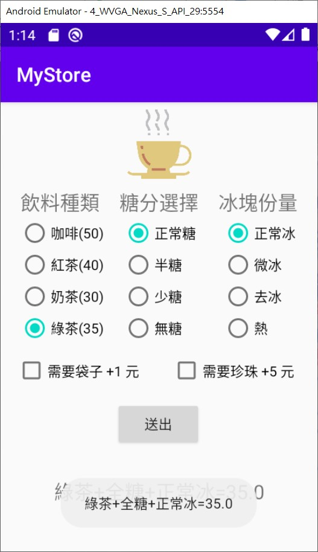

# index 點餐菜單 APP
- [index 點餐菜單 APP](#index-%e9%bb%9e%e9%a4%90%e8%8f%9c%e5%96%ae-app)
    - [第六週 ```E05``` 使用 ```RadioGroup , RadioButton , CheckBox``` ```branch 1.0```](#%e7%ac%ac%e5%85%ad%e9%80%b1-e05-%e4%bd%bf%e7%94%a8-radiogroup--radiobutton--checkbox-branch-10)
    - [第六週 課後作業](#%e7%ac%ac%e5%85%ad%e9%80%b1-%e8%aa%b2%e5%be%8c%e4%bd%9c%e6%a5%ad)
    - [第七週 ```E05``` ```branch 1.1``` 使用 ```setVisibility Toast.makeText``` 設定圖片](#%e7%ac%ac%e4%b8%83%e9%80%b1-e05-branch-11-%e4%bd%bf%e7%94%a8-setvisibility-toastmaketext-%e8%a8%ad%e5%ae%9a%e5%9c%96%e7%89%87)
    - [第九週 ```E05``` ```branch 1.2```](#%e7%ac%ac%e4%b9%9d%e9%80%b1-e05-branch-12)

### 第六週 ```E05``` 使用 ```RadioGroup , RadioButton , CheckBox``` ```branch 1.0```
- 創建 ```E05``` 並且新增 
  - 上課創建
    - ```RadioGroup``` 飲料種類 
      - ```RadioButton``` 咖啡(40元)、紅茶(50元)、奶茶(60元) 
    - ```RadioGroup``` 糖分選擇 
      - ```RadioButton``` 正常糖、半糖、少糖、無糖 
    - ```CheckBox``` 需要袋子 +1 元 
    - ```Button``` 提交
    - ```TextView``` 顯示金額
  - 下課作業新增
    - ```RadioButton``` 新增飲料種類 綠茶(70元)
    - ```RadioGroup``` 新增冰塊份量
      - ```RadioButton``` 正常冰、微冰、去冰、熱
    - ```CheckBox``` 需要珍珠 +5 元
  - 條件
  - 如果加珍珠、加袋子、選奶茶 則 +1 元
  - 如果加珍珠、選奶茶 則 +0 元
  - 如果加袋子 +1 元
  - 如果加珍珠 +5 元
  - 如果兩者都加 +6 元

圖例 如下


### 第六週 課後作業
- 延續上方
- 綠茶 35 元
- 加珍珠 +5 元
- 奶茶 + 珍珠 不加價
- 熱紅茶 , 熱綠茶 80% 優惠
- 冰熱選擇區
  - 正常冰
  - 微冰
  - 去冰
  - 熱

### 第七週 ```E05``` ```branch 1.1``` 使用 ```setVisibility Toast.makeText``` 設定圖片
- 延續上方
- ```setVisibility``` 尋找四張產品圖片 + 一張首頁圖片
- ```Toast.makeText``` 新增通知能夠顯示目前金額給使用者

 
 


### 第九週 ```E05``` ```branch 1.2```
- 延續上方 , 使用者選擇到每款飲料後，選熱飲時跳出每款不同的圖片。